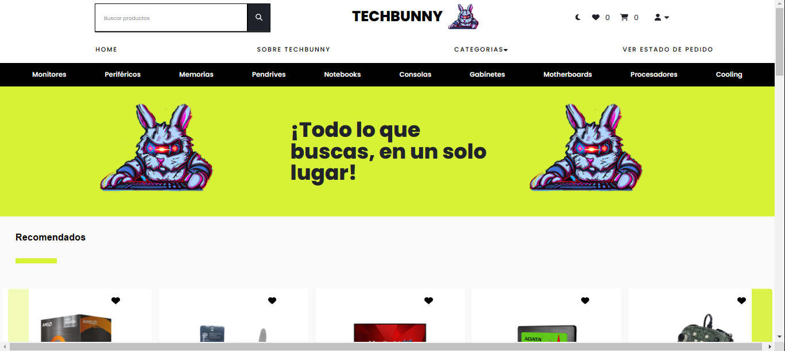
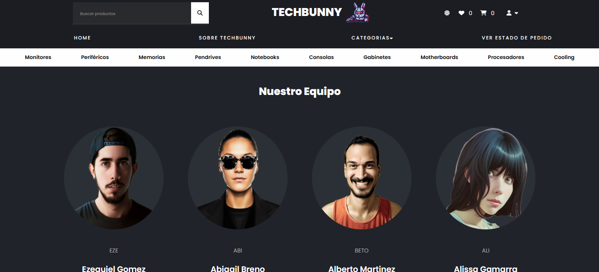
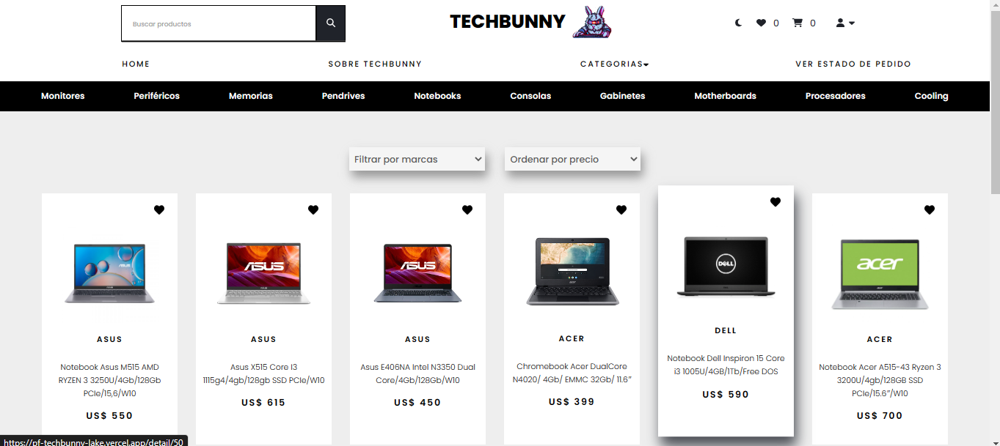
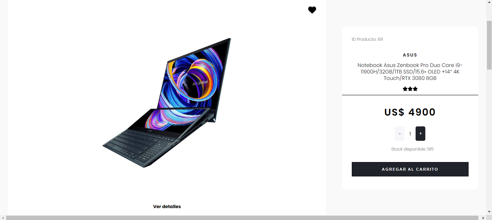
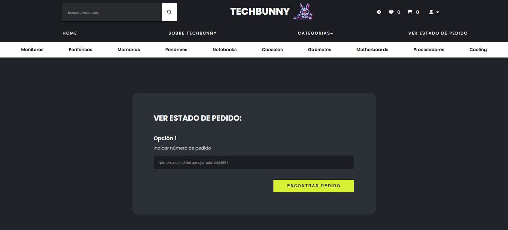
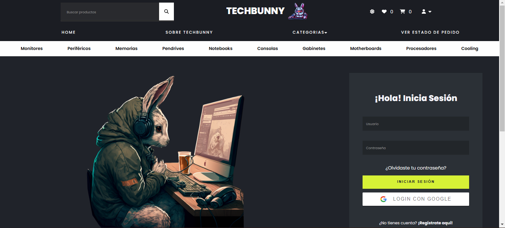
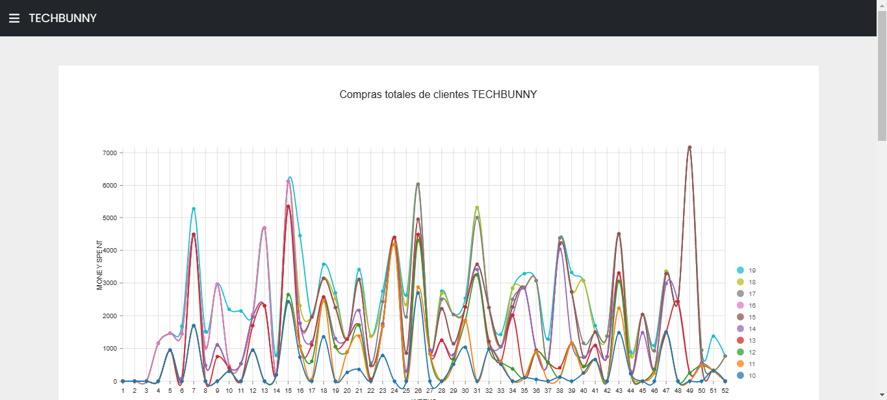

# TECHBUNNY
E-commerce de tecnología
# About the project
TECHBUNNY is a technology e-commerce that has +800 products in its catalogue, the possibility of creating an account and logging in to take advantage of all the tools we offer, a built-in payment gateway and a Dashboard with real statistics so that the administrators of the store can manage everything they need.

## Landing:

This is the first page of the e-commerce, in it you can find not only information about it but also about the people who are part of this project.

## Home:

When entering the home, the user will be able to find featured products in the form of a carousel, categories and featured brands.

## About us:

On this page the user will find the people responsible for the project, with their GitHub and LinkedIn. It should be noted that the user experience can be lived from the dark mode as well.

## Category:

Page where you will find the products separated by category, in which you can apply the corresponding filters (Brand, price and subcategory).

## Product detail:

Each product has its details page, from where the user can find all the details of the product, add to cart, add to favorites, see similar products in carousel format, and leave a comment.

## Follow Up:

From this page each user will be able to track their product through their id.

## Log in:

The e-commerce has the possibility of creating an account in Techbunny, starting a session with it or entering through google.

## Dashboard:

Dashboard to see annual statistics, create new products, manage users and purchases of them.

